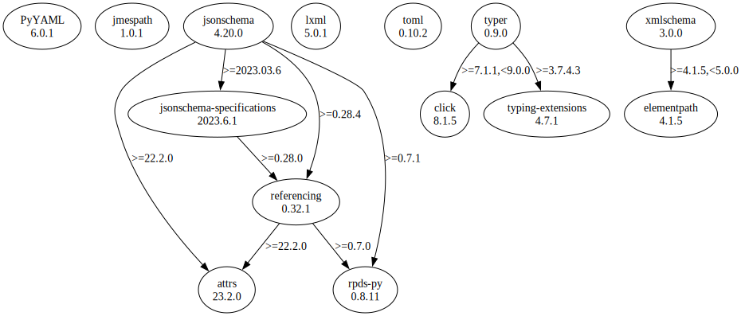

# Third Party Dependencies

<!--[[[fill sbom_sha256()]]]-->
The [SBOM in CycloneDX v1.4 JSON format](https://git.sr.ht/~sthagen/gelee/blob/default/etc/sbom/cdx.json) with SHA256 checksum ([ad8ac011 ...](https://git.sr.ht/~sthagen/gelee/blob/default/etc/sbom/cdx.json.sha256 "sha256:ad8ac011be91a05cc0ddeea96644565e126810e5f35b1e3df86bbf5a4a19433f")).
<!--[[[end]]] (checksum: 51312bf184462c29f9400b962d7a19e3)-->
## Licenses 

JSON files with complete license info of: [direct dependencies](direct-dependency-licenses.json) | [all dependencies](all-dependency-licenses.json)

### Direct Dependencies

<!--[[[fill direct_dependencies_table()]]]-->
| Name                                                            | Version                                                | License     | Author             | Description (from packaging data)                                                                |
|:----------------------------------------------------------------|:-------------------------------------------------------|:------------|:-------------------|:-------------------------------------------------------------------------------------------------|
| [PyYAML](https://pyyaml.org/)                                   | [6.0.1](https://pypi.org/project/PyYAML/6.0.1/)        | MIT License | Kirill Simonov     | YAML parser and emitter for Python                                                               |
| [jmespath](https://github.com/jmespath/jmespath.py)             | [1.0.1](https://pypi.org/project/jmespath/1.0.1/)      | MIT License | James Saryerwinnie | JSON Matching Expressions                                                                        |
| [jsonschema](https://github.com/python-jsonschema/jsonschema)   | [4.19.0](https://pypi.org/project/jsonschema/4.19.0/)  | MIT License | Julian Berman      | An implementation of JSON Schema validation for Python                                           |
| [lxml](https://lxml.de/)                                        | [4.9.3](https://pypi.org/project/lxml/4.9.3/)          | BSD License | lxml dev team      | Powerful and Pythonic XML processing library combining libxml2/libxslt with the ElementTree API. |
| [referencing](https://github.com/python-jsonschema/referencing) | [0.30.2](https://pypi.org/project/referencing/0.30.2/) | MIT License | Julian Berman      | JSON Referencing + Python                                                                        |
| [toml](https://github.com/uiri/toml)                            | [0.10.2](https://pypi.org/project/toml/0.10.2/)        | MIT License | William Pearson    | Python Library for Tom's Obvious, Minimal Language                                               |
| [typer](https://github.com/tiangolo/typer)                      | [0.9.0](https://pypi.org/project/typer/0.9.0/)         | MIT License | Sebastián Ramírez  | Typer, build great CLIs. Easy to code. Based on Python type hints.                               |
| [xmlschema](https://github.com/sissaschool/xmlschema)           | [2.4.0](https://pypi.org/project/xmlschema/2.4.0/)     | MIT License | Davide Brunato     | An XML Schema validator and decoder                                                              |
<!--[[[end]]] (checksum: b78107ca901f2bfa3d351226c868306a)-->

### Indirect Dependencies

<!--[[[fill indirect_dependencies_table()]]]-->
| Name                                                                                        | Version                                                                  | License                            | Author                                                                                | Description (from packaging data)                                    |
|:--------------------------------------------------------------------------------------------|:-------------------------------------------------------------------------|:-----------------------------------|:--------------------------------------------------------------------------------------|:---------------------------------------------------------------------|
| [attrs](https://www.attrs.org/en/stable/changelog.html)                                     | [23.1.0](https://pypi.org/project/attrs/23.1.0/)                         | MIT License                        | Hynek Schlawack <hs@ox.cx>                                                            | Classes Without Boilerplate                                          |
| [click](https://palletsprojects.com/p/click/)                                               | [8.1.5](https://pypi.org/project/click/8.1.5/)                           | BSD License                        | UNKNOWN                                                                               | Composable command line interface toolkit                            |
| [elementpath](https://github.com/sissaschool/elementpath)                                   | [4.1.5](https://pypi.org/project/elementpath/4.1.5/)                     | MIT License                        | Davide Brunato                                                                        | XPath 1.0/2.0/3.0/3.1 parsers and selectors for ElementTree and lxml |
| [jsonschema-specifications](https://github.com/python-jsonschema/jsonschema-specifications) | [2023.6.1](https://pypi.org/project/jsonschema-specifications/2023.6.1/) | MIT License                        | Julian Berman                                                                         | The JSON Schema meta-schemas and vocabularies, exposed as a Registry |
| [rpds-py](https://github.com/crate-py/rpds)                                                 | [0.8.11](https://pypi.org/project/rpds-py/0.8.11/)                       | MIT License                        | Julian Berman                                                                         | Python bindings to Rust's persistent data structures (rpds)          |
| [typing_extensions](https://github.com/python/typing_extensions)                            | [4.7.1](https://pypi.org/project/typing_extensions/4.7.1/)               | Python Software Foundation License | "Guido van Rossum, Jukka Lehtosalo, Łukasz Langa, Michael Lee" <levkivskyi@gmail.com> | Backported and Experimental Type Hints for Python 3.7+               |
<!--[[[end]]] (checksum: 8902d898540b81c6d4c71f2a8424e179)-->

## Dependency Tree(s)

JSON file with the complete package dependency tree info of: [the full dependency tree](package-dependency-tree.json)

### Rendered SVG

Base graphviz file in dot format: [Trees of the direct dependencies](package-dependency-tree.dot.txt)



### Console Representation

<!--[[[fill dependency_tree_console_text()]]]-->
````console
jmespath==1.0.1
jsonschema==4.19.0
├── attrs [required: >=22.2.0, installed: 23.1.0]
├── jsonschema-specifications [required: >=2023.03.6, installed: 2023.6.1]
│   └── referencing [required: >=0.28.0, installed: 0.30.2]
│       ├── attrs [required: >=22.2.0, installed: 23.1.0]
│       └── rpds-py [required: >=0.7.0, installed: 0.8.11]
├── referencing [required: >=0.28.4, installed: 0.30.2]
│   ├── attrs [required: >=22.2.0, installed: 23.1.0]
│   └── rpds-py [required: >=0.7.0, installed: 0.8.11]
└── rpds-py [required: >=0.7.1, installed: 0.8.11]
lxml==4.9.3
PyYAML==6.0.1
toml==0.10.2
typer==0.9.0
├── click [required: >=7.1.1,<9.0.0, installed: 8.1.5]
└── typing-extensions [required: >=3.7.4.3, installed: 4.7.1]
xmlschema==2.4.0
└── elementpath [required: >=4.1.5,<5.0.0, installed: 4.1.5]
````
<!--[[[end]]] (checksum: 773d2b7fb4aba5a264188634ca3bda13)-->
